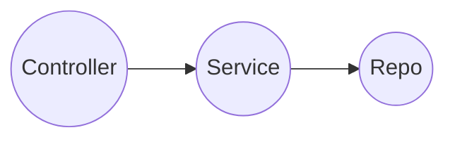
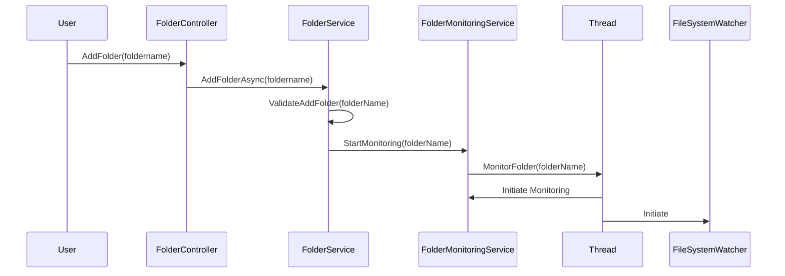
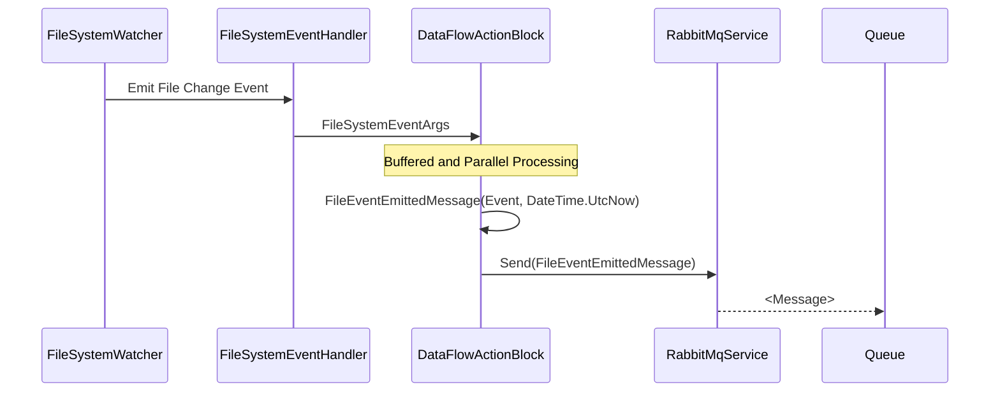
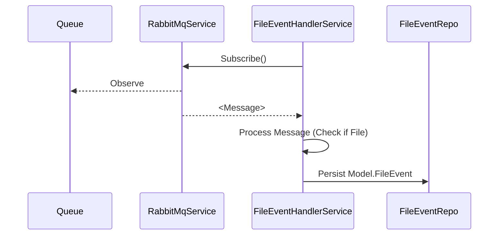

# FolderMonitor: Micro-Services Overview

The FolderMonitor solution comprises two micro-services:

* **FileListener** (Also known as _Service A_): 
  - Monitors specified folders for file change events using **FileSystemWatcher**.
  - Provides APIs for folder monitoring management: **AddFolder**, **RemoveFolder**, and **GetAllFolders** to retrieve currently monitored folders.

* **EventManager** (Also known as _Service B_): 
  - Stores emitted FileEvents in memory cache.
  - Offers query APIs for recent events: **LastEventsByFolder**, **LastEventsByEventType**, and **LastEvents**.

Technologies integrated:
* **Redis**: A high-performance, thread-safe memory cache.
* **RabbitMq**: Message queuing system for event transmission from **FileListener** to **EventManager** (Pub-Sub pattern).

## Snapshots

### File Listener (Service A)
[Swagger UI](https://localhost:5001/swagger/index.html)

### Event Manager (Service B)
[Swagger UI](https://localhost:5003/swagger/index.html)

### Backend Services 
(One-click deployment for convenience)

### Message Queuing (RabbitMq)

### Solution Structure

## Prerequisites

To deploy and run the infrastructure seamlessly, ensure the following are installed:

- .Net 7 [Download here](https://dotnet.microsoft.com/en-us/download)
- Docker Desktop [Download here](https://www.docker.com/products/docker-desktop/)
- Access to [Docker Hub](https://hub.docker.com/) for container image libraries.

## Cloning the Project

1. Launch your preferred IDE (Recommended: **VisualStudio 2022**).
2. Clone the [repository](https://github.com/JakePathFinder/FolderMonitor.git) (Main branch will suffice).

Some IDEs provide GitHub/AzureDevOps integration:
 

## Security Certificate Handling

The services communicate securely over **https**, necessitating a self-issued security certificate. Developers can generate a **dev certificate**:

- Two scripts are provided in the _certificates_ folder to streamline the process of creating and removing these certificates.
- Executing creates an _output_ directory containing `varonisdevcert.pfx`.
  
> :warning: **Warning:** These certificates are not designed for production use. Remember to clear them when not in use using _clear_dev_certificates.bat_.

## Solution Configuration

The solution comes pre-configured for ease of use. In real-world scenarios, settings should be secured and populated through a pipeline using a key vault. Primary configurations include:

- **appsettings.json** in each project folder: Contains general and custom configurations.
- **.env** file: Houses environment variables for docker-compose and container services.
- **docker-compose.yml**: Essential settings for container services and orchestration.

## 1st Time Run

### Set Debug/Run Configuration

- Enable the 1-Click setup by setting `docker-compose` as the run configuration:
    1. Right-click on the solution.
    2. Navigate to Properties -> Startup Project.
    3. Select `docker-compose` as a single startup project.

    

    Once set, you'll be ready to run the project using this configuration:

    

### Running the project

Executing the solution initiates the following process:

1. `docker-compose.yml` configuration sets up, internally executing "docker compose up":
    - Automatically pulls Docker images (if they don't exist).
    - Creates and launches Docker containers for the services: 
        - FileListener Service
        - EventHandler Service
        - RabbitMq (varonisrmq)
        - Redis
  
    View running containers in Docker Desktop -> Containers. They are listed under `docker-compose` (with a random suffix to allow other containers on the same host).

    

2. A Swagger page for the default project, FileListener, is loaded at [https://localhost:5001/swagger/index.html](https://localhost:5001/swagger/index.html).

    

    As only one project auto-launches, you'll need to manually access the other by duplicating the tab and updating the port to 5003 for the EventHandler at [https://localhost:5003/swagger/index.html](https://localhost:5003/swagger/index.html).

    

    **Congratulations!** Your project is now up and running.

# Solution & Project Structure

## Solution Structure
The solution comprises 7 projects:

* 2 micro-services projects (each accompanied by its own Test project)
* A **Common** Project (alongside CommonTests) containing shared resources, embracing the DRY (Don't Repeat Yourself) principle.
* Lastly, a virtual "docker-compose" project facilitates container orchestration.

## Micro-Service Project Structure

### Controllers, Services & Repos: Embracing the Onion Architecture

The project is architected around the Onion Architecture ([More Info](https://medium.com/expedia-group-tech/onion-architecture-deed8a554423)). This design is evident from its structure, where, following an API request, data flows sequentially from the Controller, to the Service, and then to the Repo.

### DTO and Domain Model

Typically, a _Controller_ endpoint (API) receives either simple parameters or a DTO for more intricate objects. These are then transformed into a **DomainModel**, processed by the _Service_, and subsequently directed to the _Repo_.

In our scenario, the parameters passed to controllers are straightforward primitives. Nonetheless, as observed in the EventHandler's Controller endpoint **LastEvents**, the results in the form of List<**Model.FileEvent**> are converted to List<**DTO.FileEvent**> before dispatching the response.

### Program.cs

Program.cs serves as the entry point for the micro-service. By leveraging the Extension Methods found in the **Common** project, the code remains concise and organized.

* **AddVaronisServices**: This configures Swagger, sets up Logging (using Log4Net), and integrates Common Services. Furthermore, it houses the Common Configuration (e.g., Redis, RabbitMq Connection strings) for services, primarily those instantiated as singletons.
* **UseVaronisServices**: Post building the "app", this employs shared elements like Swagger and Middleware.

### Middleware

The solution integrates two middlewares:

1. **UnhandledExceptionHandlingMiddleware**: Positioned at the topmost tier of the application (outermost segment of the pipeline), it snags Exceptions and produces an ErrorCode. Predominantly, a 400 code is returned. With the assistance of the RequestResponseFactory, it wraps the exception into a RequestResponse, indicating an error accompanied by a message.
   
   

   > :memo: **Note:** In a genuine production environment, the exact message would be obscured and the true exception logged.

2. **RequestLoggingMiddleware**: This middleware logs every inbound and outbound request/response.
   
   > :memo: **Note:** Cloud-native utilities, for instance, Application Insights, can automatically gather such data.

### AppConfig.cs (& CommonConfig.cs)

The Application Settings are sourced from the appsettings.json file. To facilitate Dependency Injection for services with **structured configuration**—as opposed to fetching configurations via path strings—a dedicated **AppConfig.cs** class is introduced and registered.

For instance, consider the setting _MaxAllowedFolders_. The journey from its configuration to class instantiation, and ultimately its utilization via DI, is depicted below:

# Memory-Cached Persistence 

Given the requirement to use memory cache, several options were considered:
* **ConcurrentDictionary**: While it's thread-safe, it's only suitable for single-instance services. Microservices need to be scalable.
* **Entity Framework In-Memory DB**: This is easy to use but introduces overhead and lacks scalability.
* **Redis cache**: Known for its speed, thread safety due to atomic operations, and scalability.

Ultimately, **Redis** was the chosen solution.

## Usage

`IRepo<T>` acts as a Data Abstraction Layer (DAL).
 

### Within the FileListener Service:

* Active folder monitoring (via Add/Remove folder APIs) persists to a set through the **IDistributedSetRepo** interface. 
  > Note: "Get" methods were deemed unnecessary and excluded from the IRepo. However, a "GetAll" method was introduced to the IDistributedSet interface.
  
   

* This interface is backed by the `DistributedSerRepoBase` abstract class.

   

  * Other types can then inherit from this class, simplifying the process of setting the appropriate key.
    
    > Note: While it's feasible to use SortedSets for indexing in the EventManager's `FileEventRepo`, a straightforward approach was taken due to time constraints.

### Within the EventHandler Service:

* The `IFileEventRepo` interface extends `_IRepo_` with a `_FileEvent_`.
  

* This interface is realized by the `FileEventRepo`.
  

### Retrieving Last x events (Query/Print) APIs

In the `FileEventRepo`, we need to store all events and retrieve the latest x events sorted by date. This could be for all events, or filtered by folder or event type. As always, there's a trade-off between time & space. Hence, the following approach was adopted:

1. A Hash collection for storing `FileEvent` data.
2. Utilization of SortedSets to index the `FileEvent` (by its ID) to optimize querying.
   * A general SortedSet for storing `FileEvent` IDs, ordered by datetime (ticks).
   * SortedSets for folder and `EventType`, both sorted by datetime (ticks).

From `FileEventRepo`:

And from `appsettings.json`:

# Message Queue Handling

Events are emitted using the **FileListener** service's **FolderMonitoringService** (utilizing `FileSystemWatcher`). However, persistence should be executed by the **EventHandler** Service.

Due to the potential for rapid event emissions, immediate capture is essential to free up resources as quickly as possible. Moreover, since the process of persisting and managing these messages is relatively slower and not time-sensitive, asynchronous processing is preferable.

Message queues offer:

* **Buffering**: To manage surges in emitted events and cater to scenarios where event emissions surpass the system's processing capacity.
* Scalability: Allowing multiple consumers to process messages.
* Features for message retry and DLQ (Dead Letter Queues). (This feature was not utilized in this solution).
* Data encryption capabilities.
* Message preservation, useful in case of service failures.

For these reasons, **RabbitMQ** was chosen due to its simplicity and familiarity.

## Management Console

The selected RabbitMQ image comes with a management console, allowing users to view Exchanges, Queues, and manage messages. Visit [http://localhost:15672/](http://localhost:15672/) (configurable). Authentication credentials (username and password) are specified during container setup via the environment variables: `RABBITMQ_DEFAULT_USER` and `RABBITMQ_DEFAULT_PASS` (these can be found in the `.env` file).

The queues showcase the `FileEventEmitted` Queue:

## Usage

* The **IMessageQueueService** interface provides basic Send, Subscribe, and Unsubscribe methods.

* This interface is realized by **RabbitMqService**.

> :memo: **Note:** RabbitMQ employs Exchanges & Queues with various configurations (Direct, Fanout, etc.). To maintain compatibility with potential future message queue technologies, a `SubscriptionId` (formed from `ExchangeName:QueueName`) is used.

# Main System Flow

## FileListener: Adding a folder to be monitored

## FileListener: File Change Event Emitted Flow

## EventHandler: Handle Emitted Event

# Troubleshooting

## Issue: Resource Startup

Certain services operate on fixed ports (e.g., RabbitMq, which uses port :5672). Occasionally, these ports might be occupied, which could prevent the respective service from starting up. The following illustrates a situation where this problem arises:

### Possible Solutions:

1. **Delayed Service Initialization:** Sometimes, a service may require additional time to initialize. You can monitor the initialization progress by accessing the container's console. To do this, navigate to Docker Desktop -> Containers -> select the desired container -> Logs.

    

    

    In such cases, it's advisable to patiently wait for the service to complete its initialization process. Once done, you can attempt to run the solution once more.

2. **Clean the Solution:** Cleaning the solution can help free up the ports that are currently occupied.

    

    After performing this action, the containers will be cleared shortly, and the port should become available.

3. **Restart the IDE:** If the above solutions don't resolve the issue, consider shutting down the IDE and reopening it after waiting for a few moments. Additionally, ensure that any command prompt windows or other potential resource-intensive applications are closed, as they might also be occupying the needed resources.

