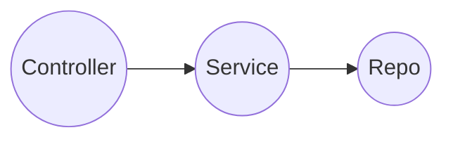

# FolderMonitor : Micro-Services Question

Folder monitor encorporates 2 Micro-Services:
* **FileListener** (A.K.A _Service A_)- Enables monitoring a folder for files change events (using **FileSystemWatcher**)
  - Exposes APIs to enable monitoring: **AddFolder**, **RemoveFolder** + **GetAllFolders** (Fetch monitored folders)
* **EventManager** (A.K.A _Service B_)- 
  - Persists the emitted FileEvents to memory cache
  - Exposes Query(Print) APIs for the last x events: **LastEventsByFolder**, **LastEventsByEventType** & **LastEvents** (All recent x events)

The solution Utilizes: 
* **Redis** as a high performant, thread safe cached memory
* **RabbitMq** for message queueing of events emitted by **FileListener** to be processed by **EventManager** (A.K.A Pub-Sub)
    
## Some images
File Listener Swagger (Service A) [@https://localhost:5001/swagger/index.html](https://localhost:5001/swagger/index.html)

Event Manager Swagger (Service B) [@https://localhost:5003/swagger/index.html](https://localhost:5003/swagger/index.html)

Backend Services (1-Click Deployment)

Message Queuing (RabbitMq)

Solution Structure

## Prerequisites
Deploying & Running the entire infrastructure is done in 1-click thanks to _Docker-Compose_

In order to enjoy these fruits, please verify you have the following prerequisites set up:
* .Net 7 Installed [Get it here](https://dotnet.microsoft.com/en-us/download)
* Docker Desktop Installed [Get it here](https://www.docker.com/products/docker-desktop/)
* Access to [Docker Hub](https://hub.docker.com/) container images library

## Cloning the project
Please follow these steps to clone the repository to your local machine:
1. Open your favorite IDE (Preferrably **VisualStudio 2022**)
2. Clone the repository [Here](https://github.com/JakePathFinder/FolderMonitor.git) (Main Brach is ok)
Some IDEs allow you to browse GitHub\AzureDevops:

## Issuing a security certificate
* Since the services communicate securely using **https**, we need to self-issue a security certificate.
   Developers can issue a **dev certificate** for these exact purposes.
  - For your convenience, i've prepared 2 scripts that handles creating & removing dev certificates for you, using _dotnet_ command.
      The scripts are located under the _certificates_ folder
      
  - Upon running, an _output_ folder is created with a varonisdevcert.pfx inside
     

   For more information about issueing dev certificates See [dotnet-dev-certs](https://learn.microsoft.com/en-us/dotnet/core/tools/dotnet-dev-certs)
   > :memo: **Note:** This certificate is copied to the containers upon running.
   >  Please verify the _CERTIFICATE_FOLDER_ .env variable is correct
     
   > :warning: **Warning:** Since Dev certificates are not secure, please clear them when you are done.
   > This can be done using _clear_dev_certificates.bat_
   > These certificates are not intended to be used in production.

## Configuring the solution
To make it easy, the solution arrives with the config. files and Environment variables already set up.
> :memo: **Note:** In a real production scenario, these settings should be ommitted from the repo and ought to be populated by the pipeline using a keyvault.

Following are the main configuration files:
* \<Project Folder\>\\appsettings.json:
    
  Contains General configurations such as Logging, Log4Net
   As well as custome configurations for the Common project (**CommonConfig**) and the current project (**AppConfig**)
    
* .env File
    
  Contains environment variables used by docker-compose and the containerized services  
* docker-compose.yml
    
  Main settings for the container services and container orcestration.
   Provides settings to backend container services, such as name, ports, enviroment variables, volumes and dependencies.

## 1st Time Run
### Set Debug\Run Configuration
* In order to enable the 1-Click setup, we need to set docker-compose as the run configuration.
    We can do so by right clicking on the solution -> Properties -> Startup Project -> select _docker-compose_ as a single startup project.
    
  After which, we'll be able to run the project using that configuration:
    
### Running the project
Running the solution triggers the following flow:
1. docker-compose.yml configuration is being set up, running "docker compose up" behind the scenes. Following which:
   - Docker images are automatically being pulled (Unless the already exist)
   - Docker containers are created and launched for each of the following service:
     + FileListener Service
     + EventHandler Service
     + RabbitMq (varonisrmq)
     + Redis
    The running containers can bee seen at DockerDesktop -> Containers, under docker-compose (a random name suffix is added to allow other containers on the same host)
      
2. A Swagger page is loaded for the default project (FileListener [@https://localhost:5001/swagger/index.html](https://localhost:5001/swagger/index.html))
     
   Since only 1 project is automatically launched, we'd need to open the other manually, by duplicating the tab and changing the port to 5003
   EventHandler [@https://localhost:5003/swagger/index.html](https://localhost:5003/swagger/index.html))
      

   **Congratulations !** We now have an up & Running project !

# Solution & Project Structure
## Solution Structure
The solution has 7 projects:
* 2 micro-services projects, each with its own Test project)
* A **Common** Project (+ CommonTests) for the common resources (Implementing DRY)
* And a virtual "docker-compose" project which incorporates the container orchestration.
   

## Micro-Service Project Structure
### Controllers, Services & Repos: The Onion Architechture
  
The project is built according to the Onion Architecture (See [More Info]([https://blog.allegro.tech/2023/02/onion-architecture.html](https://medium.com/expedia-group-tech/onion-architecture-deed8a554423))) as reflected by its structure.
Following an API request, the data flows from the Controller, to the service, then to the repo.

### DTO and Domain Model
  
Generally speaking, a _Contoller_ endpoint (API) would be recieved as simple parameters or an DTO for complex objects. 
It should then be mapped to a **DomainModel**, which is Processed by the _Service_, Moved on to the _Repo_.

In our simple case the controllers params. are simple primitives. 
However, as seen in EventHandler's Controller endpoint **LastEvents**,  
the List<**Model.FileEvent**> (results) is mapped to a List<**DTO.FileEvent**> prior to returning the response. 
  

### Program.cs
The entry point for the micro-service. 
Utilizing Extension Methods found at the **Common** project the code is kept clear and clean.
  

* **AddVaronisServices** - Configuring Swagger, Logging (Log4Net), Common Services. 
  It also contains the Common Configuration (E.G Redis, RabbitMq Connection strings) for services (mainly singletons) that belong to that project.
*  **UseVaronisServices** - After building the "app", Uses the common elements such as the Swagger and the Middleware

### Middleware

2 Middlewares exist:
1. **UnhandledExceptionHandlingMiddleware**: Handles exceptions at the top level of the application (outmost part of the pipeline).
   It catches the Exception and retuens an ErrorCode (Selectively 400, in production we would diffrentiate by exception type) 
   Utilizing the RequestResponseFactory, it encapsulats a RequestResponse which indicates a failure and the message.  
   
   > :memo: **Note:** In a real production scenario we would obfoscate the message and log the real exception.
2. **RequestLoggingMiddleware**: Automatically Logs every incoming and outgoing request\response.
   > :memo: **Note:** Cloud native tools such as Application Insights can automatically collect such information.
   

# Troubleshooting
* **Issue:** Resource startup
  Some services use fixed ports (E.G. RabbitMq, using :5672). 
  On occasion, a port may already be in use, hence it may prevent a service from starting up.
  Here's an example for such a scenario:
  
  **Possible Solutions:**
  1. Sometimes a service takes some time to start up, the container console can be accessed via DockerDektop -> Containers -> selecting the container -> Logs
       
       
     At this situation, all we need to do is wait a while for the service to completed initializing. Then _Run_ the solution again.
  2. Cleaning the solution may release resources occuping the port
       
     Shortly, the containers would be cleared and the port should be available.
  3. If the above did not assist, closing and reopening the IDE after a while (also any cmd windows that may have been in use) - can assist with occupying resources in use.
     

